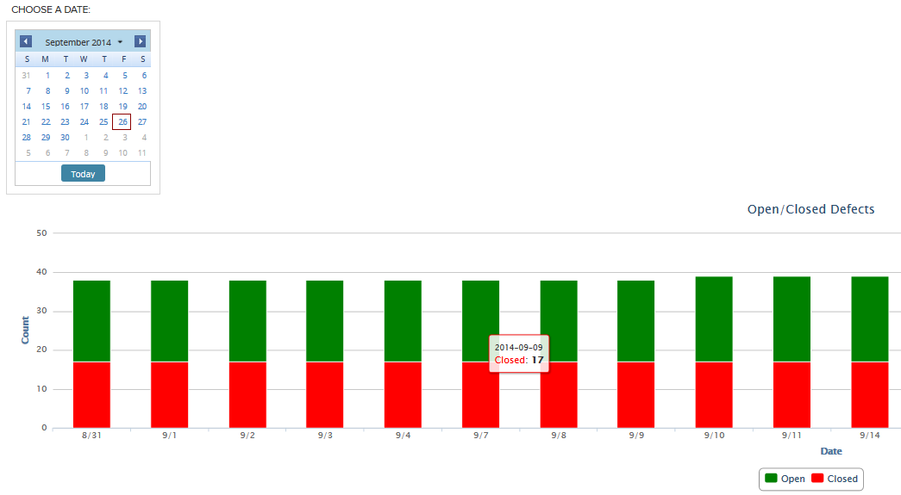
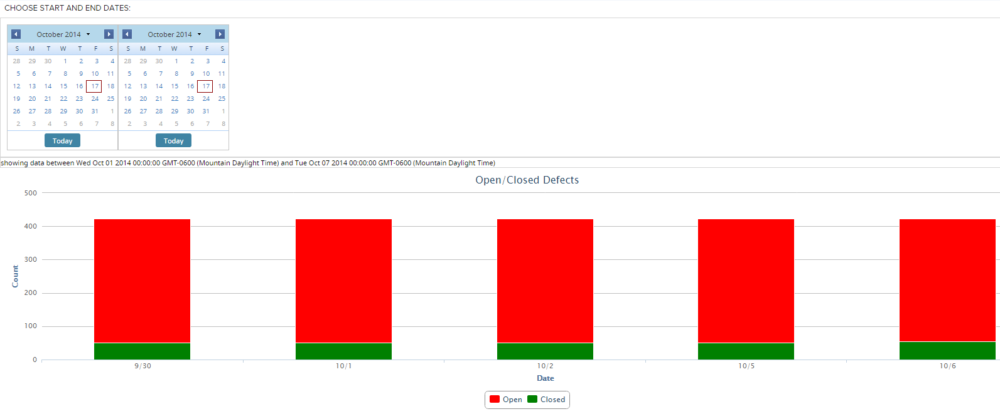

Open/Closed Defects Chart
=========================

## Overview

This is an examle of using Rally.data.lookback.calculator.TimeSeriesCalculator.

Short video showing the chart reloading on another date selection from the date picker is [here.](http://screencast.com/t/gCmfVRTytNu)

If you want to specify start and end dates for your query instead of the end date defaulting to Today, see source code in App-StartEnd.js
In the screenshot below date pickers show today's date 17 of October, but the chart is built based on the selections in the Start and End pickers, 9/30 and 10/7 respectively

This app is available AS IS. It is not supported by Rally support.
## License

AppTemplate is released under the MIT license.  See the file [LICENSE](./LICENSE) for the full text.

##Documentation for SDK

You can find the documentation on our help [site.](https://help.rallydev.com/apps/2.0rc3/doc/)
